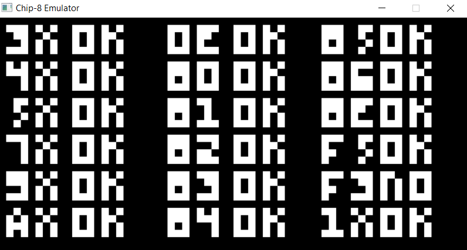

# Chip-8 Emulator
An emulator for the Chip-8 architecture, as part of an effort to learn about emulation processes. The emulator recreates the internal hardware of the chip and outputs display to the screen using the SDL library. For full details about the internal workings of the chip, including all opcodes and memory management requirements, refer to [this document](http://devernay.free.fr/hacks/chip8/C8TECH10.HTM).

To build the project locally, ensure `SDL2` is installed and run the `make` command. Note that the Makefile is only set to work on Windows machines, but a modified build command can be used to build the project for different platforms. To test the build output, the testing ROM can be used. Run `./main.exe 10 2 roms/test_opcode.ch8` to view the output. The emulator should also be compatible with any other valid Chip-8 ROM.

This project was built with reference to the implementation of [Austin Morlan](https://austinmorlan.com/posts/chip8_emulator/).

<h3>Demo</h3>

The expected output upon running the test ROM.
